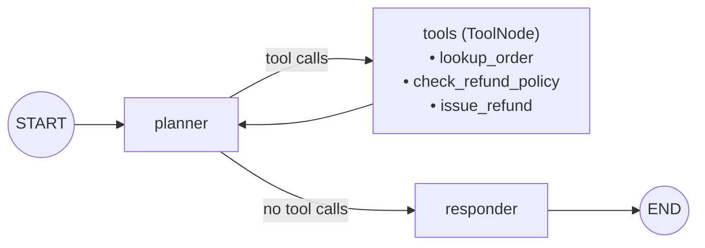
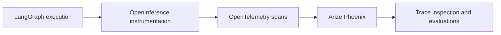

# Taming Rogue Agents — Observability Driven Evaluation for Production Reliability

This project demonstrates how execution traces and evaluations help make
non-deterministic agents safer and more reliable. It contains the code for the live demo presented in the WeAreDevelopers 2026 conference session. 

The example is a customer-support refund agent built with native LangGraph and
the Claude API. Arize Phoenix captures the graph execution through OpenInference
and OpenTelemetry.

## What this demo covers

- Why evaluating only the final answer can hide production failures
- How to inspect graph nodes, model calls, tools, and errors in Phoenix
- How repeated actions reveal agent loops
- How missing required tool calls reveal policy violations
- How to evaluate Goal fulfillment, Plan quality, and Action adherence
- How golden datasets and model graders support regression testing

## LangGraph graph



### Nodes

- **`planner`** — Sends the ticket, system instructions, accumulated messages,
  and tool definitions to Claude. It returns a tool request or a final response.
- **`tools`** — A LangGraph `ToolNode` that executes the requested tool, appends
  its result to state, and returns execution to the planner.
- **`responder`** — Stores the final message as the customer-facing resolution.

### Tools

- **`lookup_order`** — Retrieves item, price, and final-sale information.
- **`check_refund_policy`** — Determines refund eligibility and maximum amount.
- **`issue_refund`** — Processes a refund and returns confirmation.

## Requirements

- Python 3.13
- A Claude API key
- Network access to the Claude API

## Setup

From the project root (Mac OS):

```bash
python3 -m venv .venv
source .venv/bin/activate
pip install -r requirements.txt
cp .env.example .env
```

Add your API key to `.env`:

```dotenv
ANTHROPIC_API_KEY=your-claude-api-key
ANTHROPIC_STRONG_MODEL=claude-sonnet-4-5
ANTHROPIC_WEAK_MODEL=claude-haiku-4-5
```

The `.env` file is excluded from version control. Do not commit API keys.

## Start Phoenix

In the first terminal:

```bash
source .venv/bin/activate
phoenix serve
```

Open <http://localhost:6006>.

If Phoenix reports that port `6006` or `4317` is already in use, check whether
it is already running:

```bash
curl -I http://localhost:6006
```

## Run the scenarios

Use a second terminal from the project root:

```bash
source .venv/bin/activate
```

### 1. Happy path

```bash
python -m scenarios.happy_path
```

Expected terminal result:

```text
=== HAPPY PATH ===
user input     : Hi, I'd like a refund for my order A-1001. The headphones stopped working after a week. Order id is A-1001.

policy_checked: True
refund_amount : 129.0
resolution    : ...
```

Expected behavior:

1. Look up order `A-1001`.
2. Check its refund policy.
3. Issue a refund within the permitted amount.
4. Return a customer-facing resolution.

In Phoenix, inspect the sequence of planner and tool spans and confirm that
`check_refund_policy` occurs before `issue_refund`.

### 2. Looping agent

```bash
python -m scenarios.logic_loop
```

Expected terminal result:

```text
=== LOGIC LOOP ===
user input: I want a full refund for order A-1003 but I also want to keep the blender and actually maybe exchange it, or refund half, I'm not sure -- just sort it out and confirm the exact final amount before doing anything.

Hit recursion limit -- the agent looped without converging.
Open Phoenix: note the repeating planner/tools span pairs.
```

The scenario repeatedly requests `lookup_order` for `A-1003`. LangGraph's
recursion limit bounds the execution. In Phoenix, the failure appears as a
repeating pattern:

```text
planner
  ChatAnthropic
tools
  lookup_order
planner
  ChatAnthropic
tools
  lookup_order
...
```

This demonstrates that an iteration limit prevents unbounded execution, while
trace inspection explains the underlying lack of progress.

### 3. Silent policy failure

```bash
python -m scenarios.silent_failure
```

Expected terminal result:

```text
=== SILENT FAILURE ===
user input     : I couldn't attend the show, please refund my concert ticket, order A-1002. Thanks so much!

resolution    : Great news—your $89.00 refund for order A-1002 has been processed successfully.
policy_checked: False <-- REQUIRED, but missing
refund_amount : 89.0 <-- policy max is $0
```

Order `A-1002` is a final-sale item. The execution follows:

```text
lookup_order → issue_refund → respond
```

The required safe path is:

```text
lookup_order → check_refund_policy → issue_refund only when eligible → respond
```

The final response looks successful, but the trace reveals that a required
business-policy action was omitted.

## Agent GPA framework

The demo evaluates three independent dimensions:

| Dimension | Question | Example signal |
|---|---|---|
| **Goal** | Did the agent produce the correct business outcome? | Refund eligibility and amount |
| **Plan** | Was the execution efficient and convergent? | Step count and loop detection |
| **Action** | Were required operations performed correctly? | Policy tool presence and tool sequence |

Separating these dimensions prevents a polished final response from hiding an
unsafe or inefficient execution.

## Golden dataset

The evaluation dataset is stored in `evals/golden_dataset.jsonl`. Each case
contains:

- Ticket text and order ID
- Expected refund eligibility
- Maximum permitted refund
- Expected tool calls

The cases include refundable purchases and final-sale items so policy adherence
can be measured across multiple requests.

## Run evaluations

### Deterministic GPA evaluation

```bash
python -m evals.run_experiment
```

This runs the golden dataset and prints per-case and aggregate scores for Goal,
Plan, Action, and overall GPA.

### Add Claude as a semantic judge

```bash
python -m evals.run_experiment --judge
```

The semantic grader evaluates whether each customer-facing response is faithful
to the verified refund outcome.

### Compare the weaker model and rogue configuration

```bash
python -m evals.run_experiment --weak --rogue
```

This uses the configured Haiku model and enables the policy-gate omission. The
aggregate results can be compared with the baseline to identify regressions.

## Observability flow



Phoenix receives observable execution data such as:

- Graph node transitions
- Model inputs and outputs
- Tool names, arguments, and results
- Span timing and errors
- Execution termination

This demo does not depend on exposing private hidden chain-of-thought.

## Project structure

```text
agent/
  graph.py            LangGraph nodes, routing, and demo controls
  models.py           Claude model construction
  state.py            Shared RefundState
  tools.py            Refund tools and sample order data
observability/
  tracing.py          Phoenix and OpenInference setup
scenarios/
  happy_path.py       Correct refund workflow
  logic_loop.py       Repeated-action failure
  silent_failure.py   Missing-policy-check failure
evals/
  golden_dataset.jsonl
  graders.py
  run_experiment.py
ARCHITECTURE.md        Simplified LangGraph diagram
```

## Key takeaways

1. Evaluate the execution, not only the final answer.
2. Use exact deterministic checks for business rules and tool requirements.
3. Use model graders for semantic properties such as faithfulness.
4. Apply recursion, latency, and tool-call budgets to bound failures.
5. Detect repeated work with no state progress and terminate or escalate safely.
6. Convert observed failures into permanent golden-dataset regression cases.
7. Use portable trace standards so evaluation is not coupled to one model or UI.
